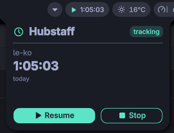

# noctalia-hubstaff

A [Noctalia](https://noctalia.dev) bar plugin that surfaces the running [Hubstaff](https://hubstaff.com) timer and exposes Start/Stop controls in your top bar — covering for the fact that the official Hubstaff Linux client's tray icon doesn't render on Wayland.



## Features (v0.1)

- Bar capsule with play/stop icon and today's tracked time (`H:MM:SS`), ticking live every second between polls.
- Click → popup with project name, today's elapsed time, a tracking/stopped badge, and Resume / Stop buttons.
- Right-click → quick context menu (Refresh, plus Start or Stop depending on current state).
- Configurable poll interval and CLI path.
- Shells out only to the official `HubstaffCLI` — no monkey-patching of activity data.

## Requirements

- Noctalia ≥ 4.4.3
- The official Hubstaff Linux client installed; the plugin shells out to `HubstaffCLI.bin.x86_64` (default path: `/home/<you>/Hubstaff/HubstaffCLI.bin.x86_64`).

## Install

Clone into your Noctalia plugins folder (or symlink from elsewhere):

```sh
git clone https://github.com/gustavohariel/noctalia-hubstaff ~/.config/noctalia/plugins/hubstaff
```

Enable in `~/.config/noctalia/plugins.json` under `states`:

```json
"hubstaff": { "enabled": true, "sourceUrl": "https://github.com/gustavohariel/noctalia-hubstaff" }
```

Add to your bar in `~/.config/noctalia/settings.json` (under `bar.widgets.right`, `.center`, or `.left`):

```json
{ "id": "plugin:hubstaff" }
```

Restart the Noctalia shell so it picks up the new plugin:

```sh
pkill -f "qs -c noctalia-shell"
```

Your compositor's autostart (Niri, Hyprland, etc.) should respawn it.

## Settings

- **CLI path** — full path to `HubstaffCLI.bin.x86_64`. Default: `/home/<you>/Hubstaff/HubstaffCLI.bin.x86_64`.
- **Refresh interval (seconds)** — how often to poll for timer state. Default: `5`. The displayed time still ticks every second between polls; this only controls how often the projection is reconciled with what Hubstaff reports.

## How it works

The plugin shells out to the Hubstaff CLI on a fixed interval and projects elapsed time forward locally between polls, so the bar updates every second without hammering the CLI. The projection re-anchors to the server value whenever the timer starts/stops, the project changes, or the local guess drifts more than a couple of seconds.

CLI invocations used:

- `HubstaffCLI status` — read current timer state.
- `HubstaffCLI --autostart resume` — start/resume the last active project (also launches the Hubstaff helper if it isn't running).
- `HubstaffCLI stop` — stop tracking.

The plugin does not bypass tracking, alter activity data, or change how Hubstaff reports work to your team.

## Troubleshooting

- **Bar shows `—` and never updates** → the CLI path is wrong or the Hubstaff client isn't installed. Open the panel; the red banner shows the parse/CLI error. Fix the path under the plugin's settings.
- **Time freezes at the value from the last poll** → check that `refreshIntervalSec` isn't set unreasonably high; the live tick still runs but only while the plugin believes the timer is running.
- **Nothing happens after `pkill`** → your compositor isn't autostarting Noctalia. Launch it manually (`qs -c noctalia-shell &`) or fix your autostart entry.

## License

MIT
